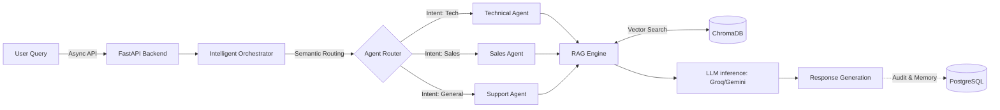

# Enterprise Multi-Agent Support Ecosystem (RAG-Powered)

[](https://www.python.org/)
[](https://fastapi.tiangolo.com/)
[](https://www.langchain.com/)
[](https://www.docker.com/)
[](https://www.postgresql.org/)

This project is a production-grade backend infrastructure designed to automate complex customer support workflows using Generative AI. It implements a sophisticated Multi-Agent Orchestration architecture that dynamically classifies user intent and routes queries to specialized agents. By leveraging Retrieval-Augmented Generation (RAG), the system ensures all AI responses are grounded in verified corporate documentation, effectively eliminating hallucinations.

---

## Architecture Overview

The system is built on a decoupled, asynchronous microservices architecture to ensure high performance and scalability.



### The Core Components
*   **API Layer:** High-performance asynchronous endpoints developed with FastAPI.
*   **Intelligent Orchestrator:** A semantic routing engine that directs queries to Support, Sales, Technical, or General agents based on intent analysis.
*   **RAG Engine:** A document processing pipeline using ChromaDB and HuggingFace/OpenAI embeddings for real-time semantic search across PDF, DOCX, and TXT files.
*   **Persistence Layer:** PostgreSQL managed via SQLAlchemy for conversation history, auditing, and system observability.

---

## Tech Stack

| Category | Technologies |
| :--- | :--- |
| **Core** | Python 3.10+, FastAPI, LangChain |
| **LLMs** | Google Gemini, Meta Llama 3.3 (via Groq) |
| **Vector Database** | ChromaDB |
| **Relational Database** | PostgreSQL, SQLAlchemy |
| **DevOps & Tasks** | Docker, Celery, Redis |

---

## Key Features & Senior Best Practices

*   **Agentic Specialization:** Distinct LLM profiles for technical troubleshooting, sales conversion, and general corporate information.
*   **Performance Optimization:** Inference calls optimized for sub-second latency using Groq LPU hardware acceleration and Gemini 1.5/2.0 models.
*   **Context Management:** Advanced conversational memory handling to maintain state across multi-turn interactions.
*   **Observability & Monitoring:** Integrated tracking of token consumption, response latency, and document relevance scores.
*   **Compliance and Security:** Architecture follows ISO 27001 principles. Includes input sanitization to prevent prompt injection and structured metadata filtering for secure document retrieval.

---

## Project Structure

```text
multi-agent-ecosystem/
├── api/                     # FastAPI routes and controllers
├── core/                    # Security, configs, and DB connections (PostgreSQL)
├── agents/                  # Multi-Agent orchestrator and LLM profiles
├── rag/                     # ChromaDB operations, embeddings, document loaders
├── schemas/                 # Pydantic models for request/response validation
├── workers/                 # Celery tasks (Redis broker) for async processing
├── docker-compose.yml       # Containerized environment setup
├── requirements.txt         # Project dependencies
└── README.md
```

---

## Getting Started

### Prerequisites
*   Docker & Docker Compose
*   API Keys for Google Gemini and/or Groq
*   Python 3.10+ (if running locally without Docker)

### 1. Environment Setup
Clone the repository and set up your `.env` file:
```bash
git clone https://github.com/your-username/multi-agent-ecosystem.git
cd multi-agent-ecosystem
cp .env.example .env
# Add your API keys and DB credentials to .env
```

### 2. Run the Pipeline
To deploy the entire ecosystem including PostgreSQL, ChromaDB, Redis, Celery workers, and the FastAPI backend:
```bash
docker-compose up --build -d
```

### 3. API Documentation
Once the containers are running, access the interactive API documentation (Swagger UI) at:
`http://localhost:8000/docs`

---

## Future Enhancements
*   Implement Kubernetes manifests (Helm charts) for highly available deployment.
*   Add a frontend UI layer (e.g., Streamlit or React) for a complete chatbot experience.
*   Integrate NeMo Guardrails for enhanced LLM output security and policy enforcement.

---

<br>
<p align="center">
  <i>Engineered with precision, scalability, and a passion for data.</i>
</p>

<p align="center">
  <a href="https://www.linkedin.com/in/david-serrano-franco-77805025b">
    
  </a>
</p>

<p align="center">
  <strong>David Serrano Franco</strong> • Senior Data Engineer
</p>
